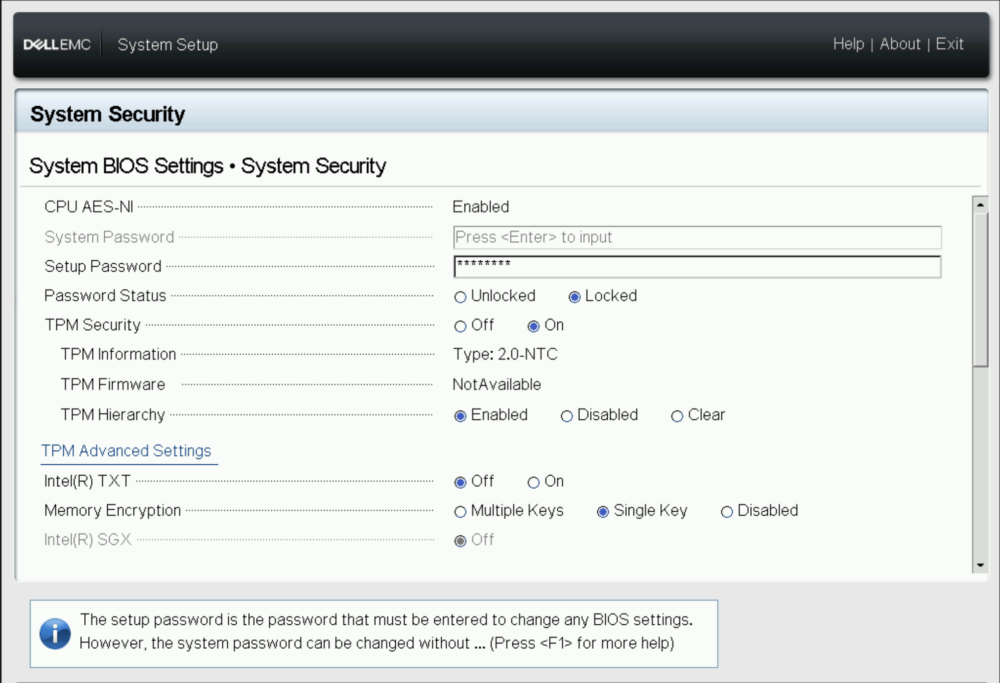
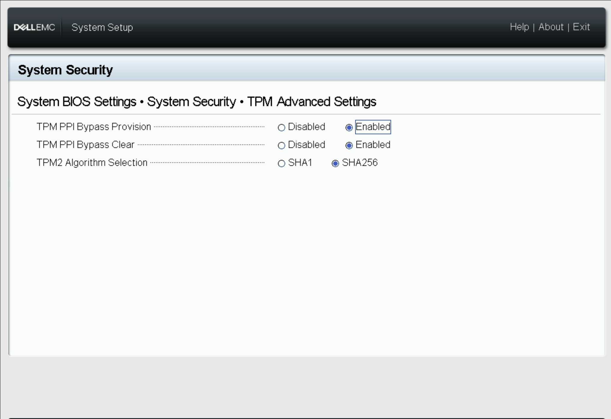
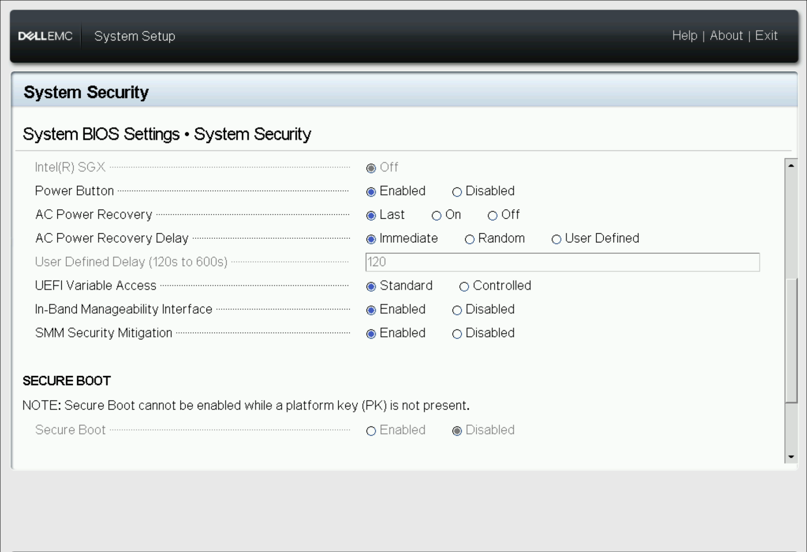
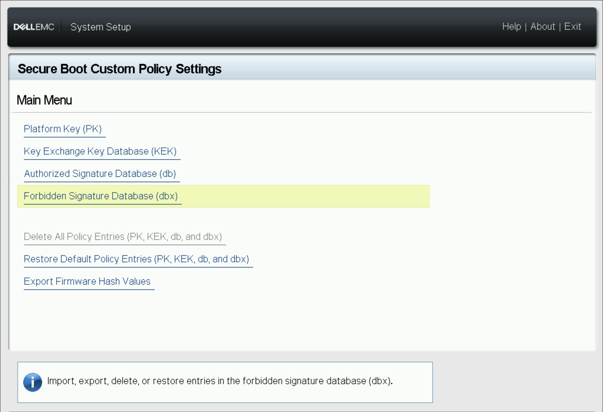

## System Security

- Set Setup Password
- Password Status -> Locked
- TPM Security -> On
- TPM Advanced Settings
    - TPM PPI Bypass Provision -> Enabled
    - TPM PPI Bypass Clear -> Enabled
    - TPM2 Algorithm Selection -> SHA256
- Memory Encryption -> Single Key (because the Xeon Silver 4310 only supports single key)
- SMM Security Mitigation -> Enabled
- Secure Boot -> Enabled
- Secure Boot Policy -> Custom
- Secure Boot Custom Policy Settings -> Delete All Policy Entries
- UEFI CA Certificate Scope -> Device Firmware

